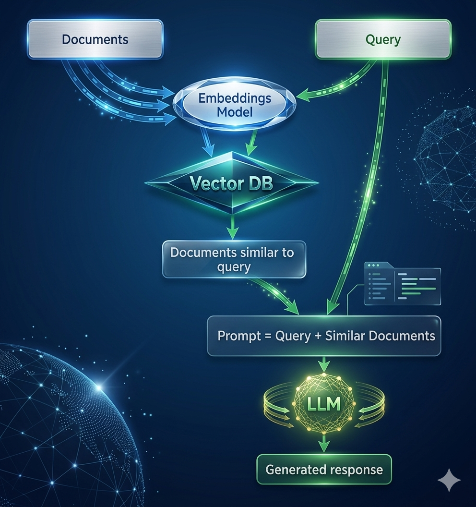

##  About This Repository

This repository presents a working prototype of a Retrieval-Augmented Generation (RAG) system. It demonstrates an end-to-end pipeline including document retrieval, answer generation, and evaluation using RAGAS metrics on a pathology report dataset. To evaluate performance, a synthetic question–answer dataset was created from the underlying papers. This dataset is used to assess the RAG system via LLM-based evaluation, measuring how well the generated responses align with the ground truth and the retrieved context.

The CSV file contains questions, and answers can be found here

```
 Data/ragas_10_new_questions.csv

```

## Vector Similarity

The retrieval process uses **cosine similarity** to compare the user query with stored document embeddings. This ensures that the system retrieves the most semantically relevant chunks based on meaning rather than exact keyword matching. Cosine similarity measures the angle between two vectors, enabling the system to effectively find similar content even when the wording differs.
For the complete Python framework and step-by-step implementation, please refer to the Jupyter Notebook:

```
RAG_RAGAS_Evaluation.ipynb
```

## What is RAG?

RAG (Retrieval-Augmented Generation) is a technique used to improve the performance of Large Language Models (LLMs). It helps address the problem of an LLM lacking specific or up-to-date information that is not part of its training data, or generating incorrect information (hallucinations).

This is especially useful when working with data that is private, frequently updated, or not included in the model’s training data.

If your data is static and does not change often, fine-tuning a model is an option. However, fine-tuning can be expensive and may lead to unwanted changes in the model’s behavior over time (also known as model drift).

Instead of fine-tuning, RAG retrieves relevant information from an external knowledge source and provides it as additional context to the LLM. This helps the model generate more accurate and reliable responses without retraining.

### References

* [Simple RAG for GitHub issues using Hugging Face Zephyr and LangChain](https://huggingface.co/learn/cookbook/rag_zephyr_langchain)
* [Simple Evaluation of RAG](https://namratanwani.medium.com/evaluate-rag-with-ragas-e1ad1aa99c2e)
---

##  RAG Pipeline

The Retrieval-Augmented Generation (RAG) pipeline improves LLM responses by grounding them in external data.

### 🔹 Phase 1: Data Preparation
- **Document Loading** → Load raw data (PDFs, text, etc.)
- **Chunking** → Split documents into smaller chunks for better retrieval
- **Embedding** → Convert each chunk into vector representations
- **Vector Storage** → Store embeddings in a vector database for fast similarity search

### 🔹 Phase 2: Retrieval & Generation
- **Query Embedding** → Convert the user query into a vector
- **Retrieval** → Retrieve top-k most similar document chunks
- **Context Building** → Combine retrieved chunks into a context
- **LLM Generation** → Pass the query + context to the LLM to generate the final answer

---

##  RAG Pipeline Diagram (Figure 1)

The figure below illustrates the full RAG workflow, including both data preparation and the query-answering process. It shows how documents are processed into embeddings, stored in a vector database, and later retrieved to provide context for the LLM. The retriever finds relevant chunks, and the reader (LLM) uses them to generate accurate and context-aware responses.



---

##  RAG Evaluation Pipeline

The evaluation pipeline measures the quality of generated answers by comparing them with the ground truth.

- Generate answers using the RAG system
- Evaluate using metrics:
  - **Faithfulness** → How well the answer is supported by the context  
  - **Answer Relevancy** → How relevant the answer is to the question  
  - **Context Precision** → How relevant the retrieved context is  
  - **Context Recall** → How much important information is retrieved  
  - **Answer Correctness** → How close the answer is to the ground truth


